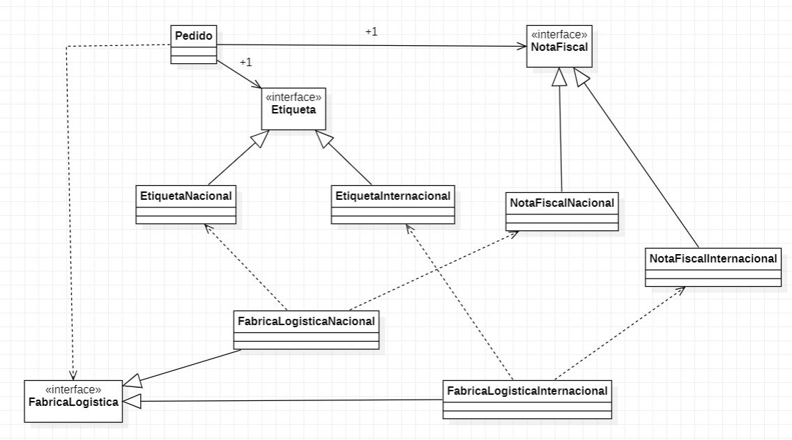

# Exercício Abstract Factory, Sistema de Logística

#### Nome: João Vitor Fernandes Ribeiro Carneiro Ramos
#### Matrícula: 202165076C

Implementação do padrão de projeto **Abstract Factory** em Java. 

## Diagrama UML

